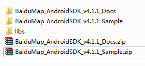
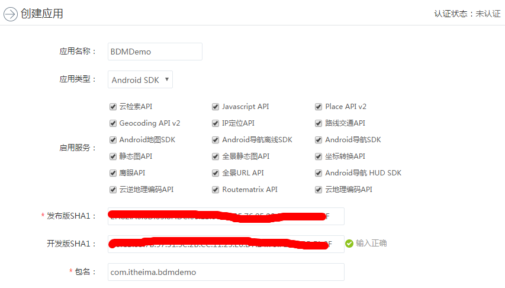

# 前言 #
现在的很多移动应用都是基于LBS(Location Based Service)，比如打车，外卖，短租, 运动类的应用，这些应用通常集成第三方的地图
服务，国内有百度地图，高德地图，腾讯地图等，国外有Google Maps, MapBox等。这里我们只和大家玩一玩百度地图，其他
的地图集成大同小异。

## 百度地图 ##
百度地图的SDK做了功能模块化的处理，每个功能模块都有独立的SDK，这样用户可以根据需求选择需要的模块集成进自己的项目。

* Android地图SDK
* Android定位SDK
* Android鹰眼轨迹SDK
* Android导航SDK
* Android导航HUD SDK
* Android全景SDK

### HUD (Heads Up Display) ###

# Android地图SDK Demo #
## 下载Demo ##
[下载地址](http://lbsyun.baidu.com/index.php?title=androidsdk/sdkandev-download)

## 导入Demo ##
解压下载下来的压缩包。

Sample目录下有两个Demo，BaiduMapsApiASDemo为Android Studio项目，BaiduMapsApiDemo为Eclipse项目，这里我们
导入BaiduMapsApiASDemo。

## 申请密钥 ##
[官方文档](http://lbsyun.baidu.com/index.php?title=androidsdk/guide/key)
### 获取Debug版本的SHA1 ###
密钥库口令为：android

### 获取Release版本的SHA1 ###
查看.android下是否存在release版本的签名文件：xxx.jks，如果没有，则在AS中创建一个。

密钥库口令为：签名文件xxx.jks的密码

## 创建应用 ##

[在终端如何复制sha1](http://jingyan.baidu.com/article/93f9803fd3a4dde0e46f55f5.html)

## 运行Demo ##
* 将创建应用生成的API_KEY，即AK，写入AndroidManifest.xml中的meta data。

		<meta-data
		   	android:name="com.baidu.lbsapi.API_KEY"
		    android:value="3iGdR8lexGkGXfsxadCOvFBTYSfnx9zf" />

* 将.android目录下的debug.keystore替换掉Demo目录下的debug.keystore，或者直接注释掉app模块下build.gradle文件中
对debug.keystore的配置，AS就会默认使用.android目录下的debug.keystore。

	    //注释掉后会默认使用.android目录下的debug.keystore
	    //signingConfigs {
	        // your debug keystore
	        //debug{
	        //    storeFile file("debug.keystore")
	        //}
	    //}
* 如果key验证成功，就会提示功能可以正常使用

# 基础地图 #
接下来我们自己写一个Demo来集成百度SDK耍一耍。
## 创建应用 ##
用AS新建一个项目，取名BDMDemo，同样的，我们先[申请密钥](http://lbsyun.baidu.com/index.php?title=androidsdk/guide/key)。

## 集成SDK ##
[集成SDK文档](http://lbsyun.baidu.com/index.php?title=androidsdk/guide/buildproject)

这里将之前下载的sdk里面libs目录下所有的jar包和so文件全部导入项目，实际项目中可以有选择的导入。

## 初始化SDK ##
[初始化SDK文档](http://lbsyun.baidu.com/index.php?title=androidsdk/guide/hellobaidumap)
### 指定debug.keystore ###
为了大家下载代码后能直接使用, 这里将我的.android目录下的debug.keystore复制到app模块目录，并在build.gradle里面指定。

    signingConfigs {
        debug {
            storeFile file("debug.keystore")
        }
    }

### 在Application类里面初始化SDK ###
    @Override
    public void onCreate() {
        super.onCreate();
        SDKInitializer.initialize(getApplicationContext());
    }

# 基础控制 #
## 放大 ##

## 缩小 ##

## 旋转 ##

## 平移 ##
- BaiduMap.animateMapStatus//有动画改变
- BaiduMap.setMapStatus  //无动画改变
- 放大 缩小  MapStatusUpdateFactory.zoomIn .zoomBy  .zoomOut  .zoomTo
- 旋转  MapStatusUpdateFactory.newMapStatus
- 移动 设置新的中心点  MapStatusUpdateFactory.newLatLng
##标注覆盖物
			//标注凌云大厦
	        MarkerOptions lyOverlayOptions = new MarkerOptions();
	        lyOverlayOptions.position(lyLat);
	        BitmapDescriptor bitmapDescriptor1 = BitmapDescriptorFactory.fromResource(R.mipmap.icon_markb);
	        lyOverlayOptions.icon(bitmapDescriptor1);
	        lyOverlayOptions.animateType(MarkerOptions.MarkerAnimateType.drop);
	        lyOverlayOptions.title("凌云大厦");
	        mBaiduMap.addOverlay(lyOverlayOptions);
	
	
	
	
	
	        //点击标注点显示详细信息
	        mBaiduMap.setOnMarkerClickListener(new BaiduMap.OnMarkerClickListener() {
	            @Override
	            public boolean onMarkerClick(Marker marker) {
	                //在当前的标注上放显示详细信息
	                InfoWindow infoWindow = new InfoWindow(infoView,marker.getPosition(),-90);
	                //初始化显示详情
	
	                infowindow_title.setText(marker.getTitle());
	                mBaiduMap.showInfoWindow(infoWindow);
	                return true;
	            }
	        });
##圆形覆盖物 矩形覆盖物
- 圆形覆盖物

		CircleOptions overlayOptions = new CircleOptions();
        overlayOptions.center(zlLat);
        overlayOptions.radius(500);
        overlayOptions.fillColor(Color.parseColor("#23ffff00"));
        Circle overlay = (Circle) mBaiduMap.addOverlay(overlayOptions);

- 矩形覆盖物

		//创建矩形覆盖物的图片
        BitmapDescriptor bitmapDescriptor = BitmapDescriptorFactory.fromResource(R.mipmap.ground_overlay);

        //第一种绘制矩形覆盖物方式
        GroundOverlayOptions overlayOptions = new GroundOverlayOptions();
        overlayOptions.dimensions(500,800);
        overlayOptions.position(zlLat);
        overlayOptions.image(bitmapDescriptor);
        mBaiduMap.addOverlay(overlayOptions);

        //第二种绘制矩形覆盖物的方式
        GroundOverlayOptions groundOverlayOptions = new GroundOverlayOptions();
        LatLngBounds latBounds = new LatLngBounds.Builder()
                .include(zlLat)
                .include(cgLat)
                .build();
        groundOverlayOptions.positionFromBounds(latBounds);
        groundOverlayOptions.image(bitmapDescriptor);
        mBaiduMap.addOverlay(groundOverlayOptions);
##地图图层

##poi搜索

##poi城市搜索

##驾车路线规划

##换乘路线规划

##定位
- 定位和地图可以分开
	- 导入定位的sdk
	- 清单文件中配置<service android:name="com.baidu.location.f" android:enabled="true" android:process=":remote">
</service> 
	- 配置权限
- 定位三个步骤
	- 获取当前位置
	- 显示定位图层
	- 移动到当前位置  